# Building a WordPress Site with Vultr VPS in 2025: A Practical Guide

Looking to launch your online presence without breaking the bank or dealing with overcomplicated hosting platforms? Here's the thing: most people think setting up a website on a VPS is rocket science. It's not. You just need the right server and a straightforward approach.

This guide walks through using Vultr VPS to get your WordPress site running—from server setup to installation. We'll cover the common hiccups (like IP blocks and SSL setup) and show you two paths: the control-freak route with server panels, and the "just make it work" one-click method.

---

## Why Vultr Makes Sense for WordPress Hosting

Vultr's been around since 2014. I've used their services for nearly a decade, and they keep delivering on the basics that matter.

**Stability You Can Count On**

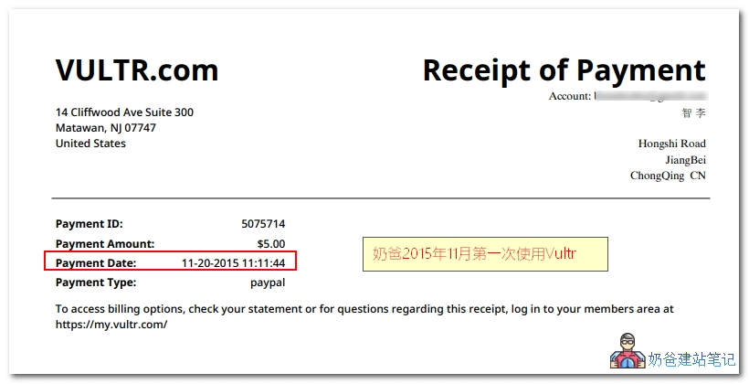

Nearly 10 years of billing records tell a simple story: the servers stay up. Their tech updates arrive on schedule, and you're not constantly putting out fires.

**Performance That Actually Performs**

I ran some tests comparing Vultr to other providers. Same specs: 1 core, 512MB RAM.

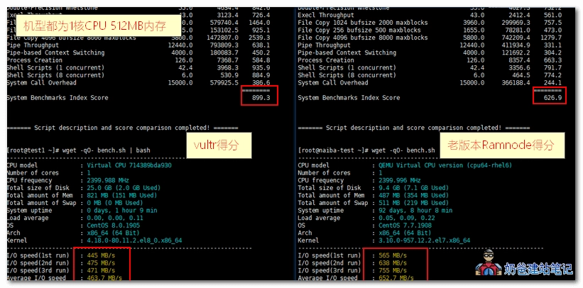

The numbers:
- Vultr scored 899 with 450 MB/s disk I/O
- Legacy RamNode: 626.9 score, 652 MB/s disk I/O  
- Current RamNode: 700+ score, but only 149.6 MB/s disk I/O

Vultr beats both versions in overall performance and comes with more storage. Need even more power? Their High Frequency plans start at $6/month.

**32 Data Centers Worldwide**

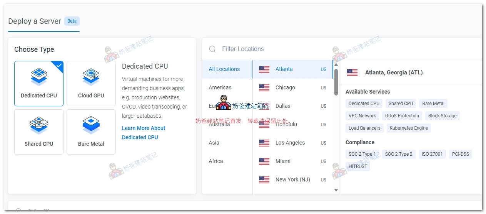

Vultr's got locations across Americas, Europe, Australia, Asia, and Africa. **32 data centers total**. For online businesses selling internationally, this matters more than you'd think.

Here's why: put your server close to your customers, and pages load faster. Faster sites = happier visitors = better conversion rates. Pretty straightforward math.

> **Note for China-based access:** Vultr doesn't optimize routes for mainland China users, so expect slower speeds if you're accessing from there. If speed is critical, consider these alternatives with CN2 routes: [1H1G1T](https://blog.naibabiji.com/go/bwh-cn2-1g), [2H2G2T](https://blog.naibabiji.com/go/bwh-cn2-2g), [2H1G1T](https://blog.naibabiji.com/go/bwh-cn2giae-211). Use code: BWH34QMFYT2R

**Support That Actually Responds**

In all my years using Vultr, I've never needed to open a support ticket. The servers just work.

That said, when people do contact support, response times are solid. More importantly, Vultr keeps their tech current—when new Linux versions drop, they update quickly. Not every provider bothers.

Their documentation library is extensive (though admittedly more useful if you read English). Still, comprehensive docs signal a company that takes their product seriously.

Plus, they accept Alipay. If you don't have an international credit card, that's huge.

👉 Ready to experience reliable VPS hosting with global reach? [Start your Vultr journey with $300 in free credits](https://www.vultr.com/?ref=9738262-9J) and see the difference quality infrastructure makes for your WordPress site.

## Getting Started with Vultr

Vultr uses hourly billing—pay only for what you use. Like prepaid phone credit: top up your account, server runs and charges by the hour. Stop the server, stop the charges. Each plan has a monthly cap. Perfect for testing or temporary projects.

[Click here to register and get $300 in trial credits](https://www.vultr.com/?ref=9738262-9J)

**Step 1:** Register through the link above to claim your $300 credit. (New users only. Requires credit card or PayPal. Credits valid for 30 days)

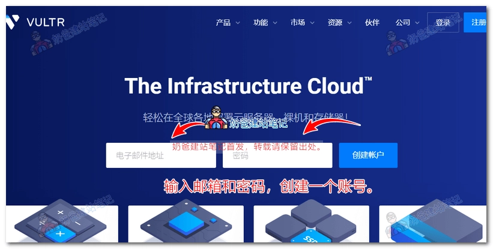

**Step 2:** **Verify your email**. Check your inbox (and spam folder if needed). No email? Try a different address and register again.

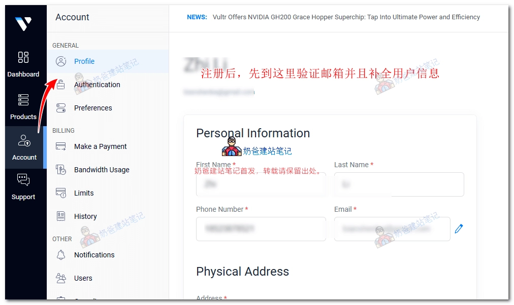

**Step 3:** After email verification, log into Vultr. Go to **Billing** on the left sidebar and **add $10 using any payment method** (required to activate trial credits).

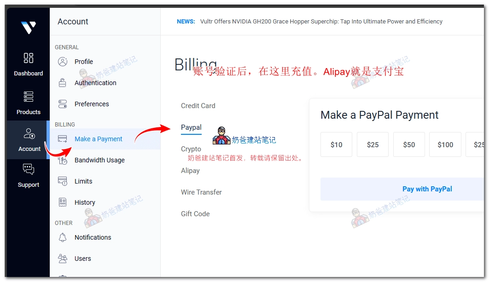

WeChat Pay is no longer available. For domestic users, Alipay remains an option. However, trial credits only apply when paying with credit card or PayPal. Remember: 30-day expiration on those credits.

## Server Deployment and Management

Account registered, payment added—now we build.

### Creating Your Server

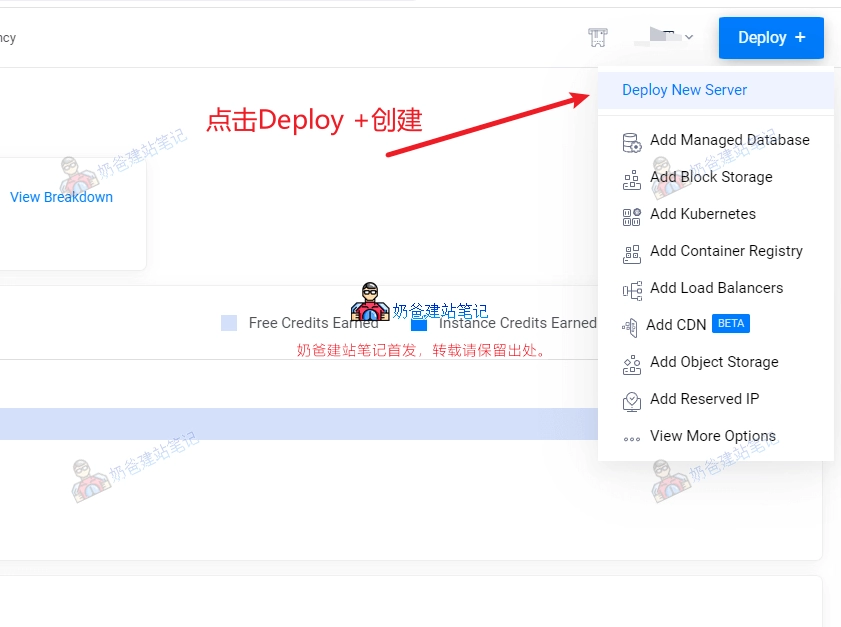

Click **Products** on the left, then the **+ button** in the top right. Select **Deploy New Server** from the menu.

1. **Server type:** For standard websites, **Shared CPU** works fine. Want more performance? Go with **Dedicated CPU**.

2. **Location:** Choose the data center closest to your target audience.

3. **Plan:** Start with **1 CPU, 2GB RAM** ($10/month minimum). Budget tight? The $6/month option works temporarily, though WordPress runs better with more memory. (WordPress officially recommends PHP 8.3+ and MySQL 8.0+ or MariaDB 10.6+—newer versions need more RAM.)

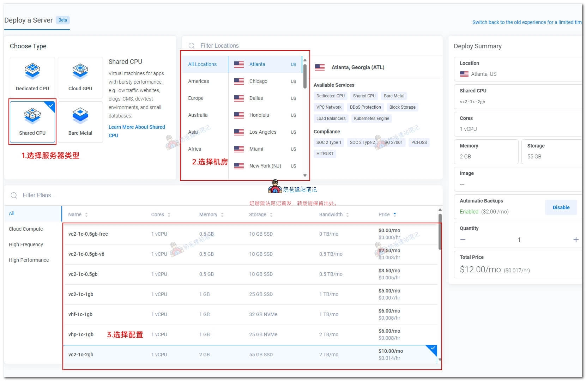

4. Click **Configure Software** at the bottom right to continue. (The **Automatic Backups** option above costs extra but provides peace of mind. Budget-conscious? Skip it and handle backups manually using [WordPress backup plugins](https://blog.naibabiji.com/tutorial/wordpress-bei-fen-cha-jian.html).)

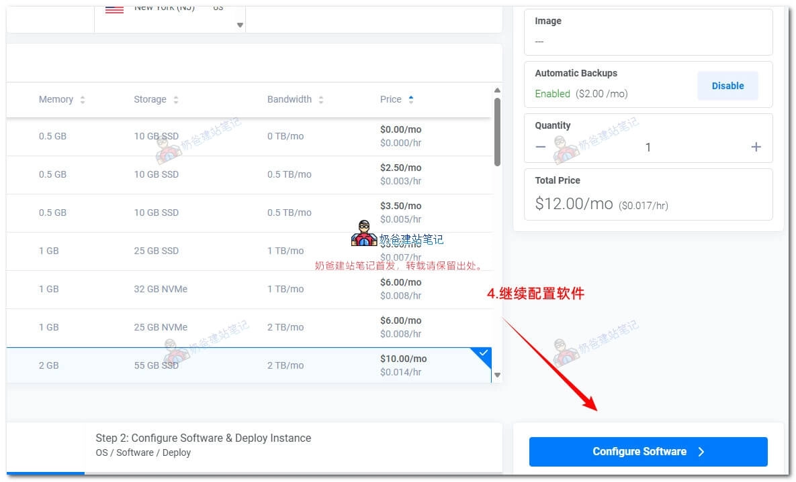

> **Pro tip:** [Test which Vultr location offers the best speed](https://blog.naibabiji.com/news/vultr-ce-su.html) for your use case. Remember: optimize for your customers' access speed, not yours. If it's slow for you, use a VPN. Your customers matter more.

**Choose the data center nearest your target customers.** They get faster load times (you might need that VPN though—customers come first).

5. **Select Operating System**

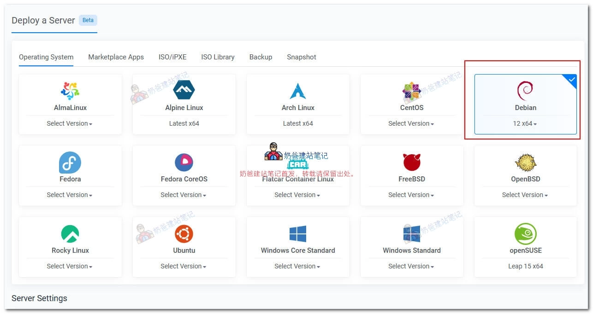

Recommended: **Debian 12**

**Important note:** This guide shows the standard approach (clean OS + manual environment setup). If that sounds like too much work, skip to the [one-click WordPress installation section](#one-click-wordpress) below.

6. **Launch the server**

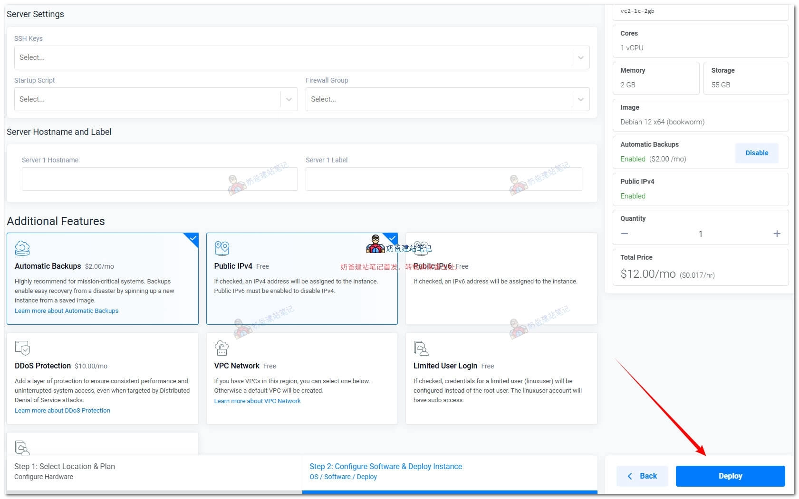

Leave **Hostname** and **Label** blank or add English labels to identify your servers. In **Additional Features**: choose Automatic Backups if you want them, **definitely enable IPv4**, IPv6 is optional, consider Limited User Login for security. Then hit **Deploy**.

### Managing Your Server

Server's running. Time to set up the website environment. (Quick ad: Don't want to do this yourself? I'll handle the complete setup for $198. [Contact me here](https://blog.naibabiji.com/contact).)

First, install management software: [Free VPS management tools Xshell6/Xftp6 Chinese version](https://blog.naibabiji.com/files/xshell-xftp.html) (Mac users: your built-in Terminal works—no separate guide for Mac since I don't have one)

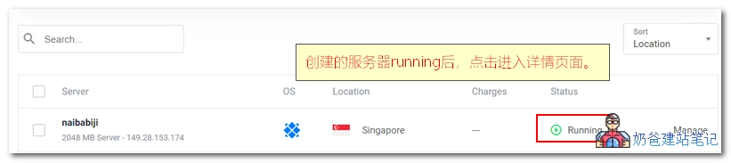

Click into your server's detail page. In **Xshell**, click **New** and enter your **server IP** in the host field.

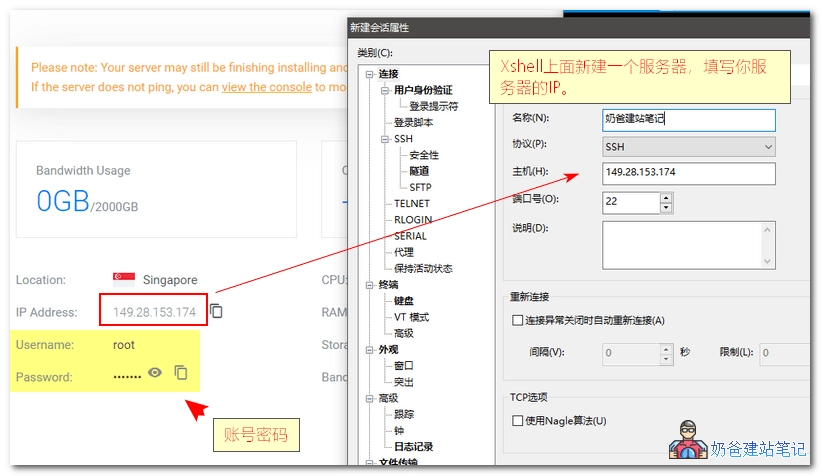

Click **Connect**. A prompt appears—click **Accept and Save**.

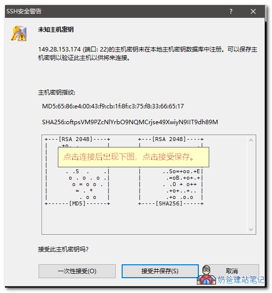

**Note:** If this prompt never appears, try pinging your server IP. No response? Probably blocked. Delete the server (destroy it), create a new one. Sometimes you'll create 10+ servers before finding an unblocked IP—that's normal with Vultr these days.

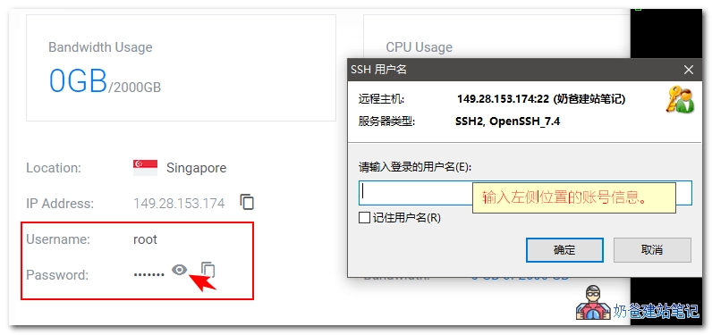

Enter the credentials from your Vultr dashboard to connect. Success looks like this:

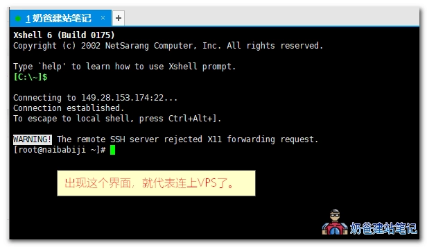

You're in. Next: installing the web environment.

### Installing a Server Panel

For beginners, server panels simplify everything. We'll use one here. (Alternative: [one-click WordPress installation](#one-click-wordpress) if you're only running a single site.)

**First, register for a panel account** (free registration button in top right):

[Register for panel account](https://www.bt.cn/u/MECE6g)

After registration, return to Xshell. Copy this command, right-click in Xshell to paste (hit Enter if it doesn't execute):

```bash
wget -O install.sh https://download.bt.cn/install/install-ubuntu_6.0.sh && sudo bash install.sh ed8484bec
```

(The screenshot shows CentOS, but use the command above for Debian 12. [Video tutorial available](https://blog.naibabiji.com/tutorial/install-bt.html) if text instructions aren't clear.)

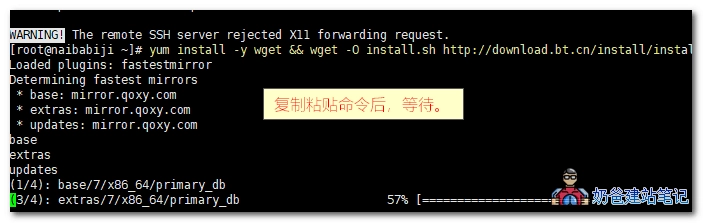

When prompted: `Do you want to install Bt-Panel to the /www directory now?(y/n):` type **y** and hit Enter.

Wait until you see this:

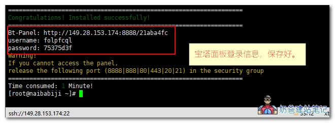

Open the URL shown in your browser and log in.

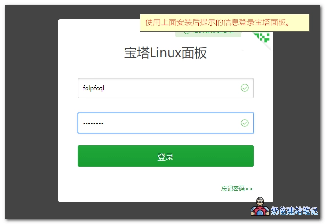

Accept the agreement and access the panel backend.

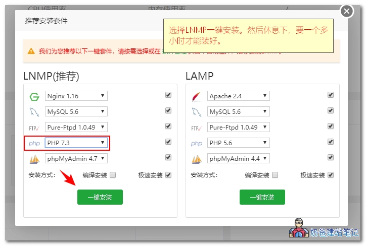

A software installation prompt appears. **Choose PHP 7.4** (the screenshot is outdated—use 7.4 or higher). For database: MySQL 5.6 or 5.7 works, though newer versions run better on higher-spec servers. Nginx: stick with the recommended version. Click one-click install.

Installation takes 1-2 hours. Go do something else. We'll continue after it finishes. (Maybe handle the domain DNS setup described in the next section while you wait.)

Not a fan of this panel? Try [installing LNMP stack instead](https://blog.naibabiji.com/tutorial/an-zhuang-lnmp-tu-wen-jiao-cheng.html).

## Installing WordPress

Software installation complete? Time to get WordPress running.

### Part 1: Point Your Domain

Before installing anything, configure DNS. Add an A record at your domain registrar pointing to your server IP.

### Part 2: Add Your Site

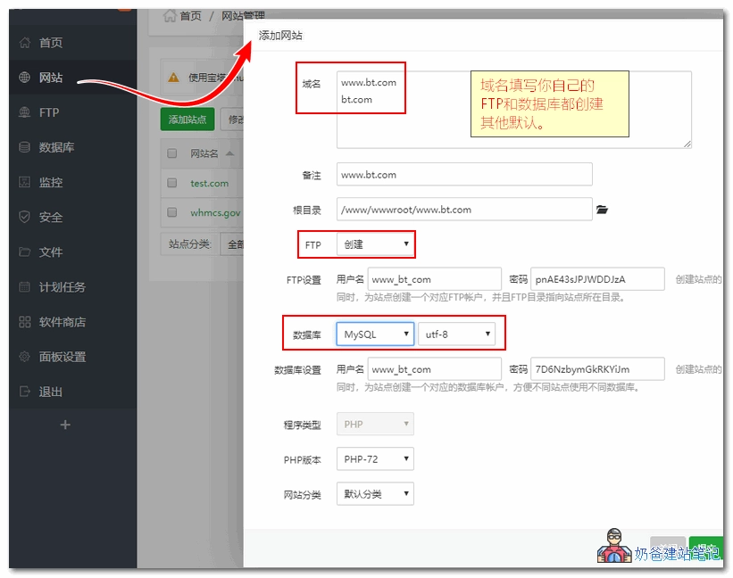

In the panel: **Website** → **Add Website**.

Enter your domain, create FTP and database credentials, then submit.

Once DNS propagates, visiting your domain shows this:

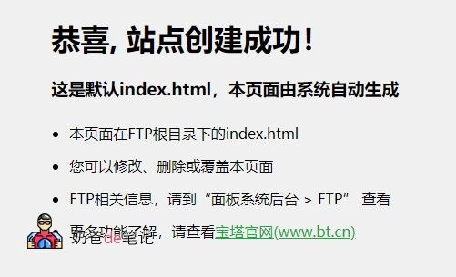

Site successfully added.

### Part 3: Configure SSL and Permalinks

Before installing WordPress, set up SSL certificates and permalink rules. More efficient this way.

**SSL Certificate Setup:** Back in the website list, click **Settings** next to your site, then select **SSL**.

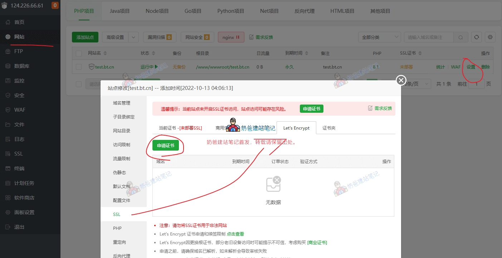

The free Let's Encrypt certificate works perfectly. Have a paid certificate? Paste its contents here instead.

**Permalink Rules:** In panel backend: **Website** → **Settings** (for your site) → **Rewrite**, select **WordPress**, save.

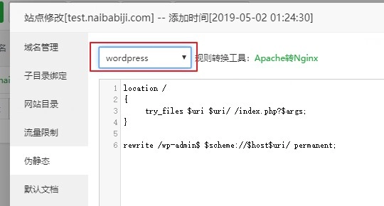

### Part 4: WordPress Installation

#### Download WordPress

Upload locally or download directly to server. We'll use remote download. Navigate to your site's root directory:

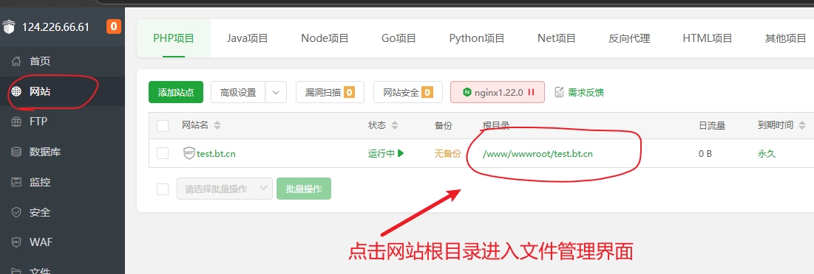

Select **Download from URL**:

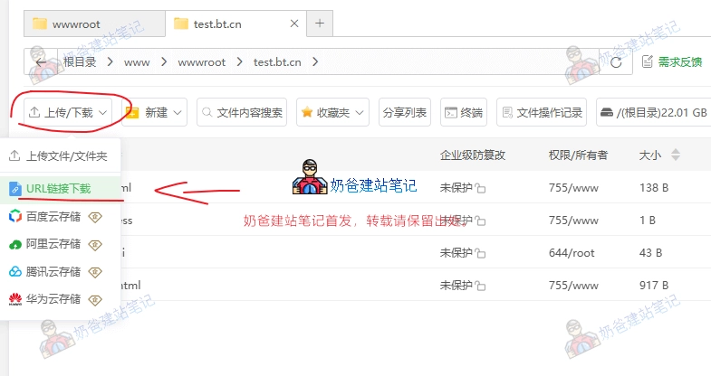

**WordPress download URL:** https://cn.wordpress.org/latest-zh_CN.zip

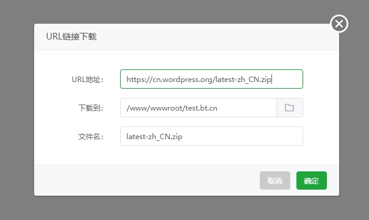

After download completes, click **Extract** next to the archive:

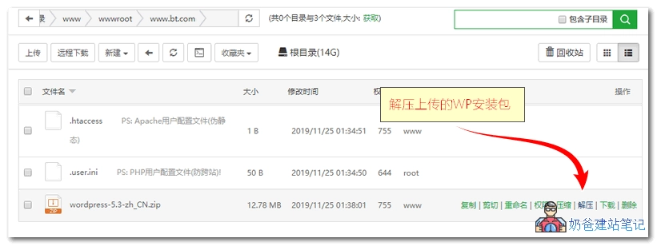

In the extraction window, click **Extract**.

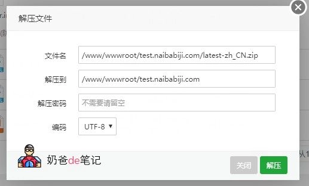

Extraction creates a wordpress folder:

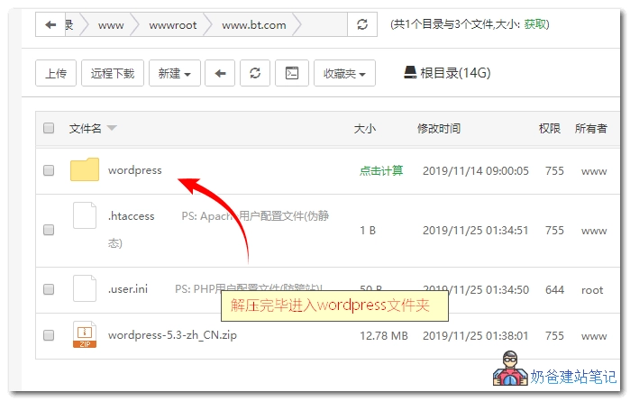

Open the wordpress folder.

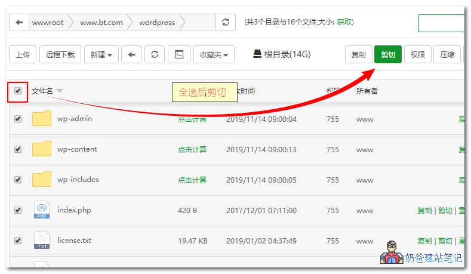

Check the box to select all files, click **Cut** in the top right.

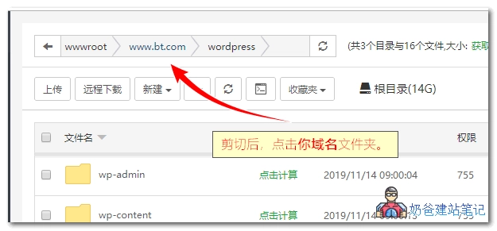

Click your domain name (red arrow) to return to the domain folder, then **Paste All**.

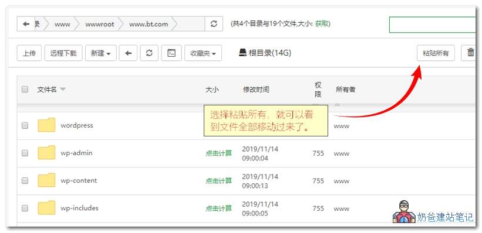

Your file manager should now look like this:

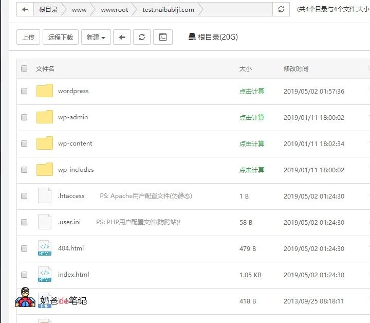

Ready to install.

#### Browser Installation

Open your domain in a browser. Click "**Let's go!**"

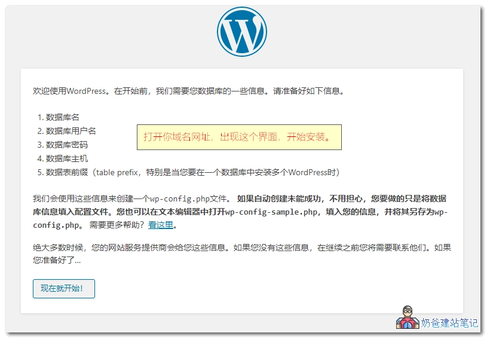

Enter your database name, username, and password. Click **Submit**.

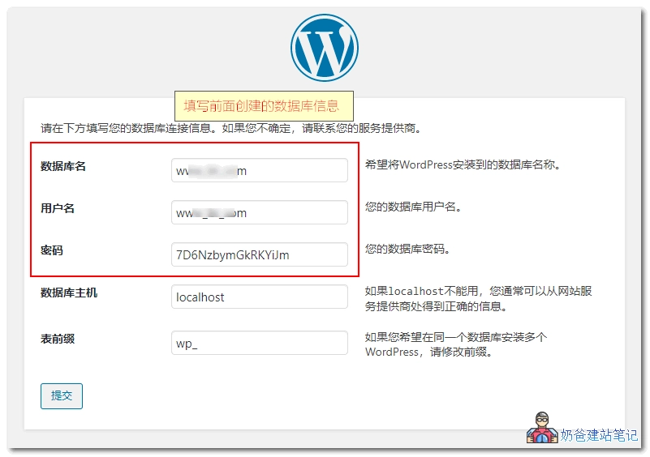

Correct credentials lead here. Click **Run the installation**.

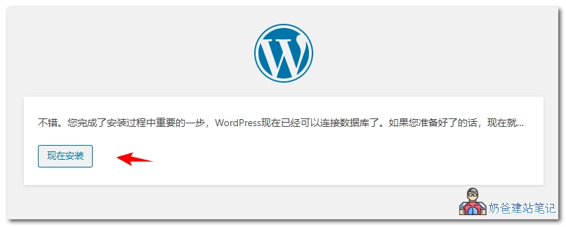

Set your site title, admin username, password, and email. Click **Install WordPress**.

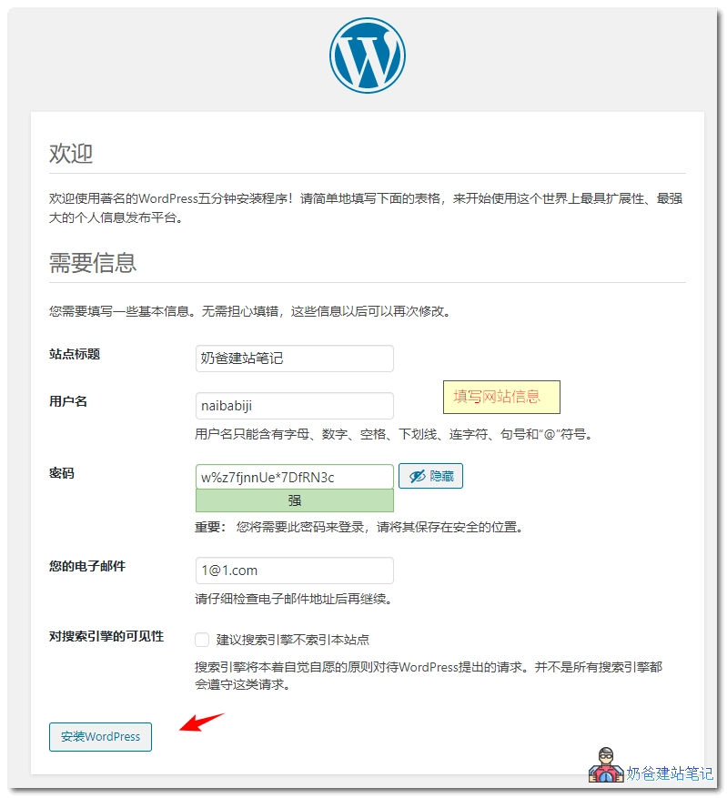

Done. You can log in now.

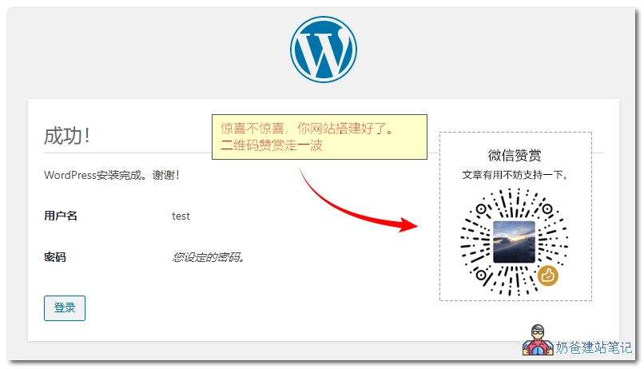

**That's it.** Your Vultr-hosted WordPress site is live.

What's left? Customize your theme, tweak settings, add content. The hard part's over.

Questions? Need help? I also offer [complete website setup services](https://blog.naibabiji.com/greatdigit) if you'd rather skip the DIY route.

## One-Click WordPress Installation

The panel method gives you more control, but some people just want their site running without the headache. Here's the express lane.

During [server creation](#creating-your-server), when selecting your OS, switch to **Marketplace Apps** and choose **OpenLiteSpeed WordPress**. Deploy.

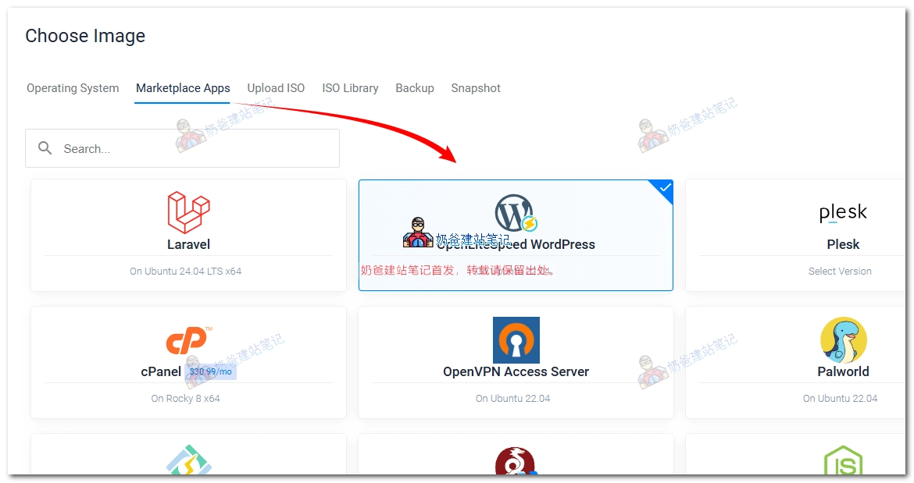

After deployment, click your server in the list to view details.

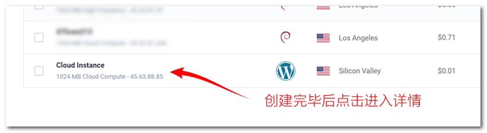

You'll see your IP, username, and password. Use Xshell to connect (see [Managing Your Server](#managing-your-server) section for Xshell setup).

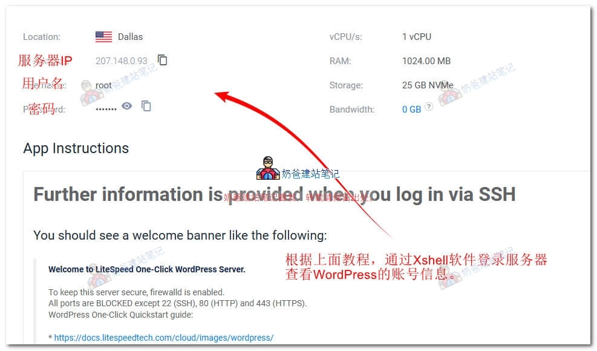

After connecting via Xshell, you'll see default WordPress information.

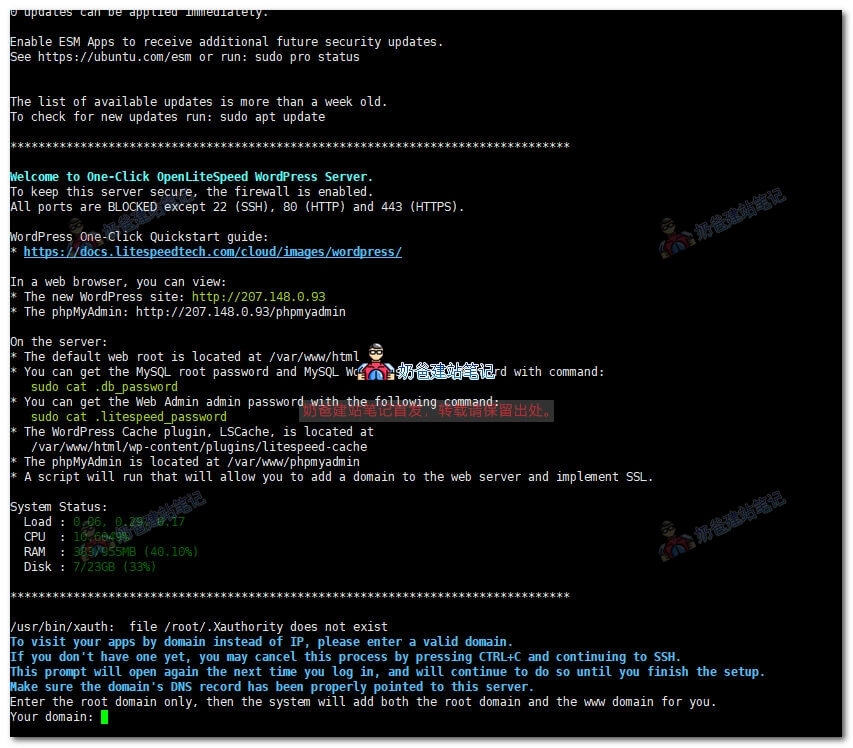

The system explains where everything's installed and prompts you to enter a domain. It'll automatically configure DNS and SSL certificates—but only if you've already registered your domain and pointed it to your server IP.

Haven't done that yet? Either handle domain setup now, or press CTRL+C to skip (the prompt returns next login).

**Recommended approach:** Set up domain DNS first, wait a few minutes for propagation, then enter your domain in the prompt above. Access your site via domain, not IP.

DNS setup: Add an A record at your domain registrar pointing to your server IP.

After entering your domain and email when prompted, the system configures everything automatically. You'll see confirmation that certificates installed successfully.

Once complete, open your domain in a browser for the WordPress setup screen:

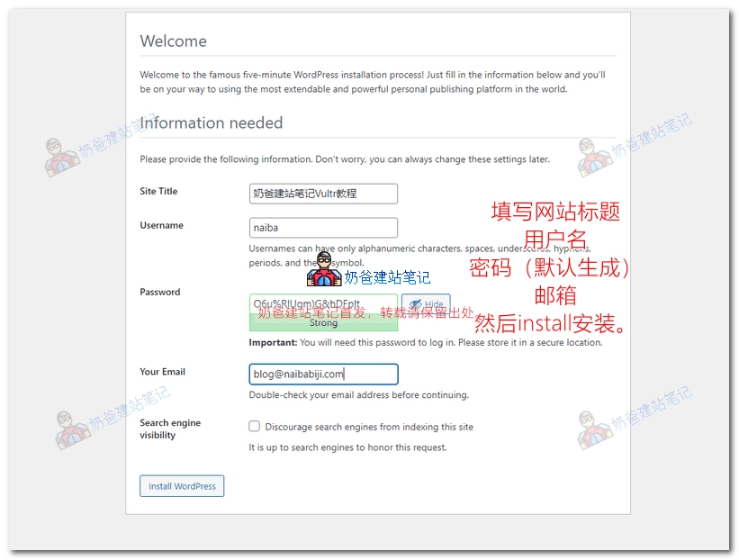

The **Search engine visibility** checkbox is worth checking during development—it prevents Google from indexing your incomplete site. Uncheck it in Settings once you're ready to launch.

**If you installed via IP first, then set up DNS later:** Manually update your site URLs in WordPress Settings to use your domain instead of the IP address.

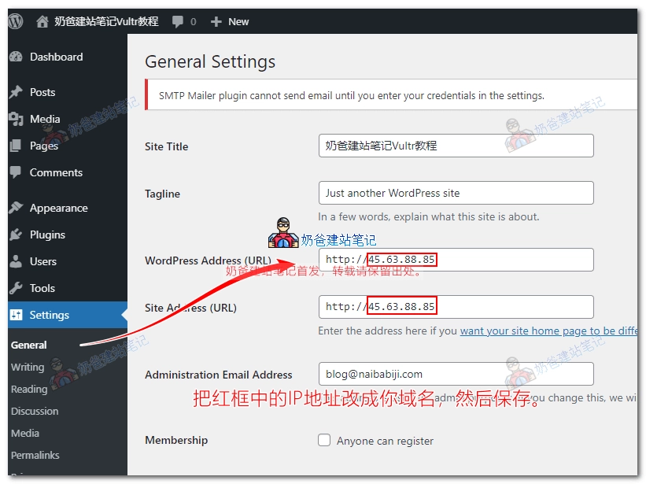

Done. WordPress is running.

---

## Final Thoughts

Setting up WordPress on Vultr isn't complicated—just follow the steps. You've got two paths: full control with a server panel, or quick deployment with one-click installation. Pick what matches your comfort level.

The result's the same: a functional WordPress site on reliable infrastructure. Vultr's global data centers and consistent performance make it a solid choice for websites targeting international audiences.

👉 Experience why thousands choose Vultr for their WordPress hosting needs. [Get started with $300 in credits](https://www.vultr.com/?ref=9738262-9J) and build your site on infrastructure that actually works.
